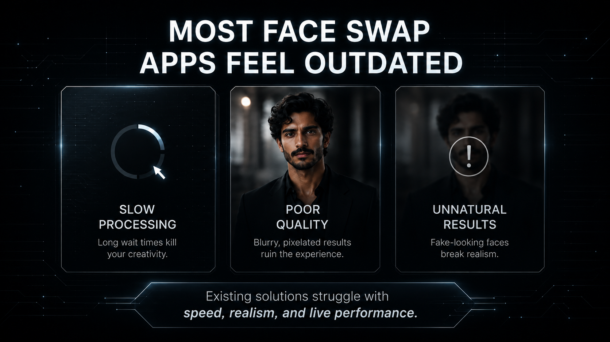
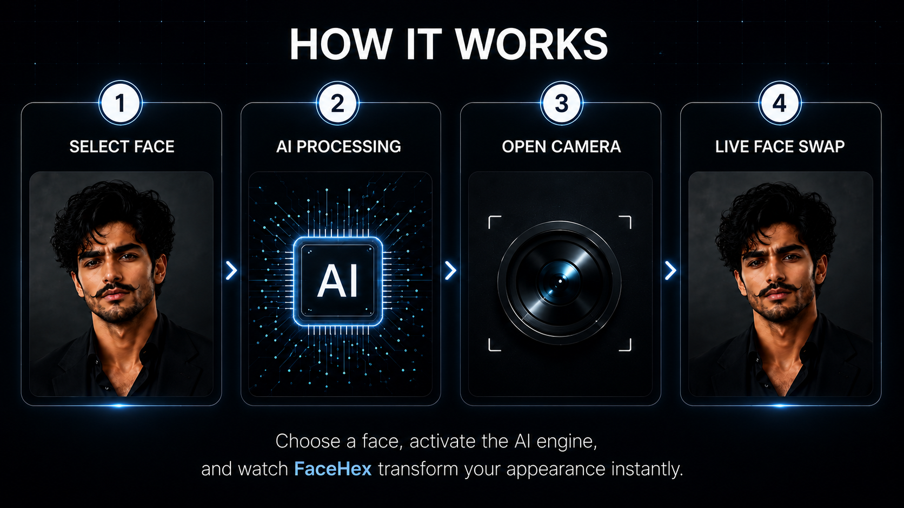
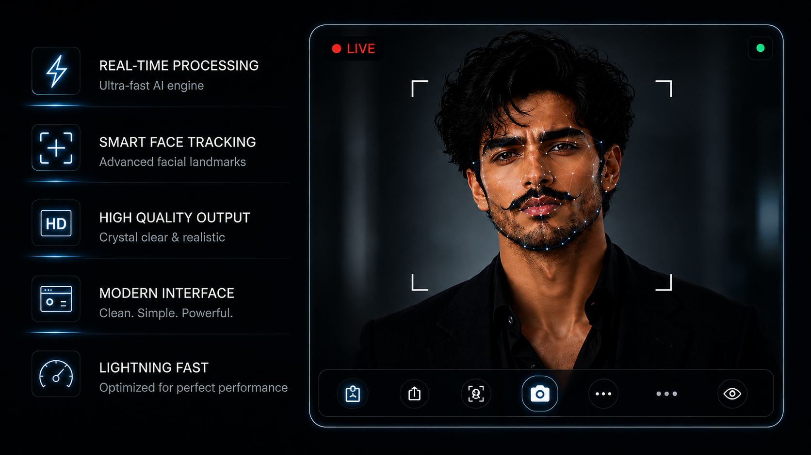
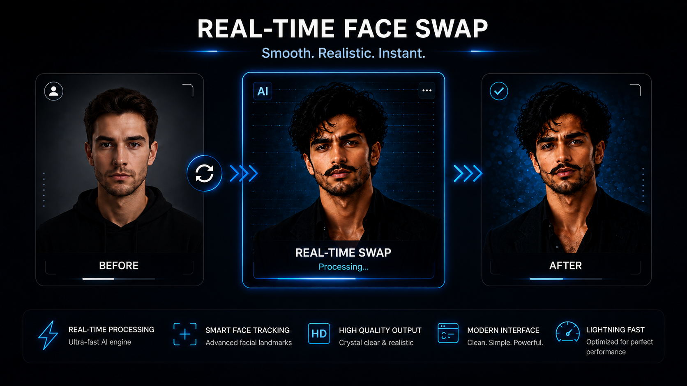
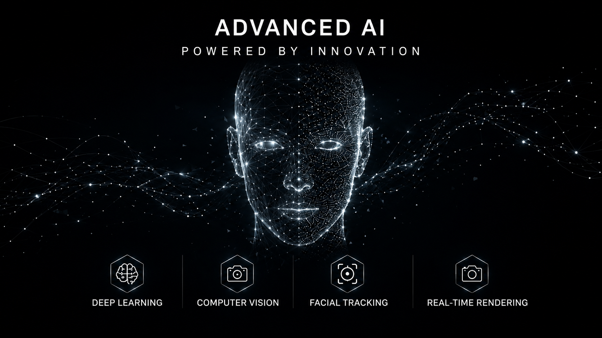

  

  # FaceHex
  **Real-Time Face Swap Engine for Android**

  *Experience seamless, live face transformations powered by advanced computer vision and intelligent on-device facial tracking.*

  
  
  
  

---

## 🌌 Where Reality Evolves
**FaceHex** is a premium, real-time face-swapping engine engineered exclusively for Android. By fusing intelligent facial analysis, computer vision, and high-fidelity live rendering, FaceHex delivers smooth, natural identity transformations directly through your device's camera.

Built on a strict **privacy-first philosophy**, all processing occurs locally on your device. This ensures ultra-responsive performance, zero latency in transmission, and absolute control over your personal content.

---

## ✨ Core Engine & Capabilities

FaceHex abandons traditional, static image editing in favor of a continuous, fluid live camera system. It dynamically maps facial geometry frame-by-frame for an immersive, broadcast-quality experience.

*   ⚡ **Live Face Swapping:** Instantaneous visual transformation with zero rendering wait times.
*   🎯 **Intelligent Facial Tracking:** Precision landmark detection that adapts to motion and lighting.
*   ✨ **Natural Face Blending:** Seamless skin tone matching and edge blending for photorealistic results.
*   🔒 **Privacy-First Architecture:** 100% on-device processing. No cloud uploads. No data harvesting.
*   🚀 **Responsive Performance:** Highly optimized engine leveraging native Android hardware acceleration.

---

## ⚙️ The Transformation Pipeline

> **1. Select Face**
> Choose a target face from your local gallery to establish the baseline identity.
> 
> **2. Intelligent Detection**
> The engine scans facial structures and maps key geometric landmarks in milliseconds.
> 
> **3. Smart Alignment**
> Dynamic spatial tracking naturally synchronizes the source image with the live camera feed.
> 
> **4. Live Transformation**
> A continuous, high-fidelity transformation is rendered in real-time while the camera remains active.

---

## 📱 Application Preview

  

 

<table align="center">
  <tr>
    <td></td>
    <td></td>
  </tr>
  <tr>
    <td></td>
    <td></td>
  </tr>
  <tr>
    <td></td>
    <td></td>
  </tr>
  <tr>
    <td></td>
    <td></td>
  </tr>
</table>

### 🎬 Demo Video

### 🎭 Before vs. After
| Original | Transformed |
| :---: | :---: |
|  |  |

---

## 📥 Get the App

FaceHex is now officially live. Download it directly from the Google Play Store or grab the latest APK release from GitHub.

  
    
  

---

## 👨‍💻 Developed By

**Guman Rajpurohit**  
*Cyber Security Researcher | Android Developer | Computer Vision Enthusiast*  
🌐 [facehex.qzz.io](https://facehex.qzz.io/)

 

  <b>FaceHex — Real-Time Face Swap Engine</b> 
  Made with ❤️ by Guman Rajpurohit

